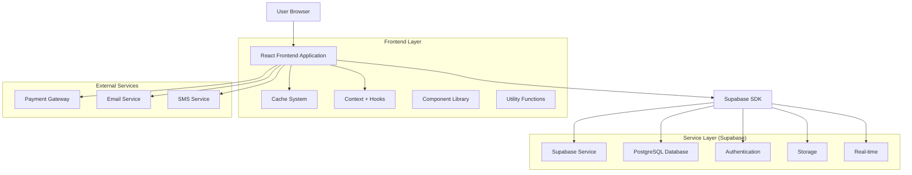
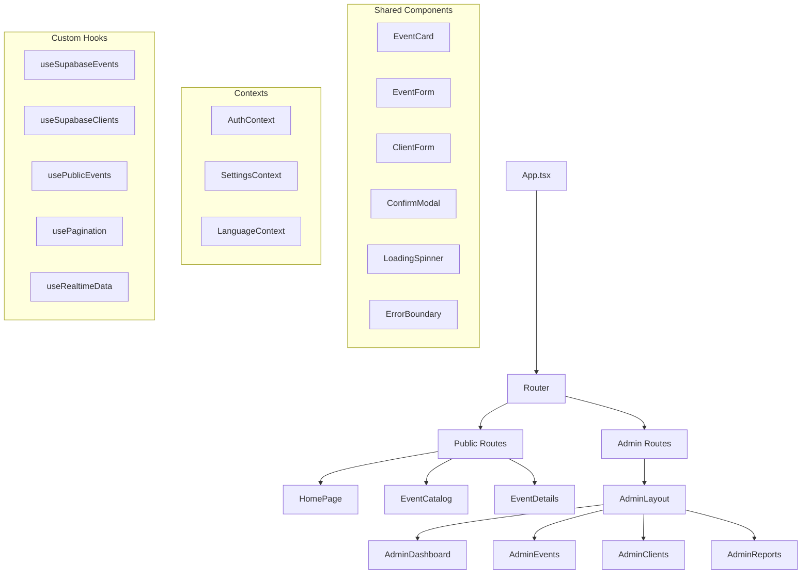
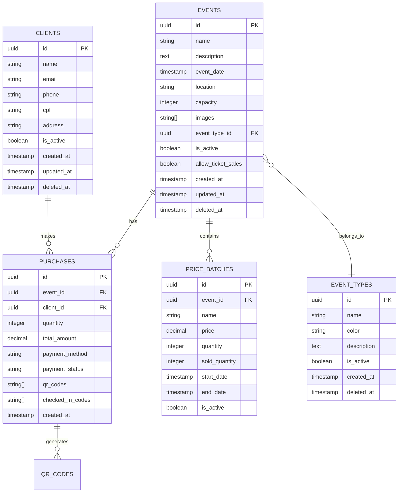

# 🏗️ Arquitetura Técnica - Better Now Refatorado

## 1. Arquitetura do Sistema



## 2. Stack Tecnológico

**Frontend:**
- React@19.1.1 + TypeScript@5.8.2
- Vite@6.2.0 (build tool)
- Tailwind CSS@4.1.13 (styling)
- React Router DOM@7.9.1 (routing)
- Framer Motion@12.23.16 (animations)
- React Hook Form@7.63.0 + Zod@4.1.11 (forms/validation)
- Lucide React@0.544.0 (icons)
- Sonner@2.0.7 (notifications)

**Backend/Database:**
- Supabase (PostgreSQL + Auth + Storage + Real-time)

**Development Tools:**
- ESLint + Prettier (code quality)
- Husky + lint-staged (git hooks)
- Vitest (testing)
- Storybook (component documentation)

## 3. Definições de Rotas

| Rota | Propósito |
|------|-----------|
| `/` | Homepage pública com hero section e eventos em destaque |
| `/eventos` | Catálogo público de eventos com filtros |
| `/eventos/:id` | Página de detalhes do evento com sistema de compra |
| `/admin/login` | Página de login administrativo |
| `/admin/dashboard` | Dashboard principal com métricas e visão geral |
| `/admin/eventos` | Gestão completa de eventos (CRUD) |
| `/admin/clientes` | Gestão de clientes e lista pré-aprovada |
| `/admin/relatorios` | Relatórios financeiros e análises |
| `/admin/checkin` | Sistema de check-in digital com QR Code |
| `/admin/configuracoes` | Configurações gerais do sistema |

## 4. Definições de API (Supabase)

### 4.1 Core API Endpoints

**Autenticação**
```typescript
// Login administrativo
supabase.auth.signInWithPassword({
  email: string,
  password: string
})

// Logout
supabase.auth.signOut()

// Verificar sessão
supabase.auth.getSession()
```

**Eventos**
```typescript
// Listar eventos públicos
supabase
  .from('events')
  .select('*')
  .eq('is_active', true)
  .eq('deleted_at', null)

// Buscar evento por ID
supabase
  .from('events')
  .select(`
    *,
    event_types(name, color),
    price_batches(*)
  `)
  .eq('id', eventId)
  .single()

// Criar evento
supabase
  .from('events')
  .insert({
    name: string,
    description: string,
    event_date: string,
    location: string,
    capacity: number,
    event_type_id: string,
    images: string[],
    // ... outros campos
  })
```

**Clientes**
```typescript
// Listar clientes
supabase
  .from('clients')
  .select('*')
  .eq('deleted_at', null)
  .order('created_at', { ascending: false })

// Verificar cliente na lista pré-aprovada
supabase
  .from('clients')
  .select('id, name, email')
  .or(`email.eq.${email},cpf.eq.${cpf}`)
  .eq('is_active', true)
  .single()
```

**Compras/Ingressos**
```typescript
// Criar compra
supabase
  .from('purchases')
  .insert({
    event_id: string,
    client_id: string,
    quantity: number,
    total_amount: number,
    payment_method: string,
    qr_codes: string[]
  })

// Validar QR Code
supabase
  .from('purchases')
  .select(`
    *,
    events(name, event_date),
    clients(name, email)
  `)
  .contains('qr_codes', [qrCode])
  .single()
```

### 4.2 Tipos TypeScript Compartilhados

```typescript
// Tipos de Evento
interface Event {
  id: string;
  name: string;
  description: string;
  basic_description?: string;
  detailed_description?: string;
  event_date: string;
  event_time?: string;
  location: string;
  location_link?: string;
  capacity: number;
  current_participants: number;
  images: string[];
  videos?: string[];
  event_type_id: string;
  is_active: boolean;
  allow_ticket_sales: boolean;
  created_at: string;
  updated_at: string;
  deleted_at?: string;
  event_types?: EventType;
  price_batches?: PriceBatch[];
  schedule?: ScheduleItem[];
}

// Tipos de Cliente
interface Client {
  id: string;
  name: string;
  email: string;
  phone?: string;
  cpf?: string;
  cnpj?: string;
  address?: string;
  city?: string;
  state?: string;
  zip_code?: string;
  is_active: boolean;
  created_at: string;
  updated_at: string;
  deleted_at?: string;
}

// Tipos de Compra
interface Purchase {
  id: string;
  event_id: string;
  client_id: string;
  quantity: number;
  unit_price: number;
  total_amount: number;
  payment_method: 'pix' | 'credit_card' | 'debit_card';
  payment_status: 'pending' | 'paid' | 'cancelled' | 'refunded';
  qr_codes: string[];
  checked_in_codes: string[];
  created_at: string;
  updated_at: string;
}

// Tipos de Lote de Preços
interface PriceBatch {
  id: string;
  event_id: string;
  name: string;
  price: number;
  quantity: number;
  sold_quantity: number;
  start_date: string;
  end_date: string;
  is_active: boolean;
  created_at: string;
}
```

## 5. Arquitetura de Componentes



## 6. Modelo de Dados

### 6.1 Diagrama Entidade-Relacionamento



### 6.2 DDL (Data Definition Language)

**Tabela de Eventos**
```sql
-- Criar tabela de eventos
CREATE TABLE events (
    id UUID PRIMARY KEY DEFAULT gen_random_uuid(),
    name VARCHAR(255) NOT NULL,
    description TEXT,
    basic_description TEXT,
    detailed_description TEXT,
    event_date TIMESTAMP WITH TIME ZONE NOT NULL,
    event_time TIME,
    location VARCHAR(500) NOT NULL,
    location_link VARCHAR(500),
    capacity INTEGER NOT NULL DEFAULT 0,
    current_participants INTEGER DEFAULT 0,
    images TEXT[] DEFAULT '{}',
    videos TEXT[] DEFAULT '{}',
    event_type_id UUID REFERENCES event_types(id),
    is_active BOOLEAN DEFAULT true,
    allow_ticket_sales BOOLEAN DEFAULT false,
    created_at TIMESTAMP WITH TIME ZONE DEFAULT NOW(),
    updated_at TIMESTAMP WITH TIME ZONE DEFAULT NOW(),
    deleted_at TIMESTAMP WITH TIME ZONE
);

-- Índices para otimização
CREATE INDEX idx_events_event_date ON events(event_date DESC);
CREATE INDEX idx_events_is_active ON events(is_active);
CREATE INDEX idx_events_deleted_at ON events(deleted_at);
CREATE INDEX idx_events_event_type ON events(event_type_id);
```

**Tabela de Clientes**
```sql
-- Criar tabela de clientes
CREATE TABLE clients (
    id UUID PRIMARY KEY DEFAULT gen_random_uuid(),
    name VARCHAR(255) NOT NULL,
    email VARCHAR(255) UNIQUE NOT NULL,
    phone VARCHAR(20),
    cpf VARCHAR(14) UNIQUE,
    cnpj VARCHAR(18) UNIQUE,
    address TEXT,
    city VARCHAR(100),
    state VARCHAR(2),
    zip_code VARCHAR(10),
    numero VARCHAR(10),
    is_active BOOLEAN DEFAULT true,
    created_at TIMESTAMP WITH TIME ZONE DEFAULT NOW(),
    updated_at TIMESTAMP WITH TIME ZONE DEFAULT NOW(),
    deleted_at TIMESTAMP WITH TIME ZONE
);

-- Índices
CREATE INDEX idx_clients_email ON clients(email);
CREATE INDEX idx_clients_cpf ON clients(cpf);
CREATE INDEX idx_clients_is_active ON clients(is_active);
CREATE INDEX idx_clients_deleted_at ON clients(deleted_at);
```

**Tabela de Compras**
```sql
-- Criar tabela de compras
CREATE TABLE purchases (
    id UUID PRIMARY KEY DEFAULT gen_random_uuid(),
    event_id UUID NOT NULL REFERENCES events(id),
    client_id UUID NOT NULL REFERENCES clients(id),
    quantity INTEGER NOT NULL DEFAULT 1,
    unit_price DECIMAL(10,2) NOT NULL,
    total_amount DECIMAL(10,2) NOT NULL,
    payment_method VARCHAR(20) CHECK (payment_method IN ('pix', 'credit_card', 'debit_card')),
    payment_status VARCHAR(20) DEFAULT 'pending' CHECK (payment_status IN ('pending', 'paid', 'cancelled', 'refunded')),
    qr_codes TEXT[] DEFAULT '{}',
    checked_in_codes TEXT[] DEFAULT '{}',
    created_at TIMESTAMP WITH TIME ZONE DEFAULT NOW(),
    updated_at TIMESTAMP WITH TIME ZONE DEFAULT NOW()
);

-- Índices
CREATE INDEX idx_purchases_event_id ON purchases(event_id);
CREATE INDEX idx_purchases_client_id ON purchases(client_id);
CREATE INDEX idx_purchases_payment_status ON purchases(payment_status);
CREATE INDEX idx_purchases_created_at ON purchases(created_at DESC);
```

**Tabela de Lotes de Preços**
```sql
-- Criar tabela de lotes de preços
CREATE TABLE price_batches (
    id UUID PRIMARY KEY DEFAULT gen_random_uuid(),
    event_id UUID NOT NULL REFERENCES events(id),
    name VARCHAR(100) NOT NULL,
    price DECIMAL(10,2) NOT NULL,
    quantity INTEGER NOT NULL,
    sold_quantity INTEGER DEFAULT 0,
    start_date TIMESTAMP WITH TIME ZONE NOT NULL,
    end_date TIMESTAMP WITH TIME ZONE NOT NULL,
    is_active BOOLEAN DEFAULT true,
    created_at TIMESTAMP WITH TIME ZONE DEFAULT NOW()
);

-- Índices
CREATE INDEX idx_price_batches_event_id ON price_batches(event_id);
CREATE INDEX idx_price_batches_dates ON price_batches(start_date, end_date);
CREATE INDEX idx_price_batches_is_active ON price_batches(is_active);
```

**Políticas RLS (Row Level Security)**
```sql
-- Habilitar RLS
ALTER TABLE events ENABLE ROW LEVEL SECURITY;
ALTER TABLE clients ENABLE ROW LEVEL SECURITY;
ALTER TABLE purchases ENABLE ROW LEVEL SECURITY;
ALTER TABLE price_batches ENABLE ROW LEVEL SECURITY;

-- Políticas para eventos (público pode ler eventos ativos)
CREATE POLICY "Public can view active events" ON events
    FOR SELECT USING (is_active = true AND deleted_at IS NULL);

CREATE POLICY "Authenticated can manage events" ON events
    FOR ALL USING (auth.role() = 'authenticated');

-- Políticas para clientes (apenas autenticados)
CREATE POLICY "Authenticated can manage clients" ON clients
    FOR ALL USING (auth.role() = 'authenticated');

-- Políticas para compras (apenas autenticados)
CREATE POLICY "Authenticated can manage purchases" ON purchases
    FOR ALL USING (auth.role() = 'authenticated');

-- Políticas para lotes de preços (público pode ler, autenticados podem gerenciar)
CREATE POLICY "Public can view active price batches" ON price_batches
    FOR SELECT USING (is_active = true);

CREATE POLICY "Authenticated can manage price batches" ON price_batches
    FOR ALL USING (auth.role() = 'authenticated');
```

**Dados Iniciais**
```sql
-- Inserir tipos de eventos padrão
INSERT INTO event_types (name, color, description) VALUES
('Festa Infantil', '#FF6B6B', 'Eventos para crianças e famílias'),
('Evento Corporativo', '#4ECDC4', 'Eventos empresariais e networking'),
('Celebração', '#45B7D1', 'Aniversários, casamentos e comemorações'),
('Workshop', '#96CEB4', 'Cursos, palestras e capacitações'),
('Show', '#FFEAA7', 'Apresentações musicais e artísticas');

-- Inserir configurações iniciais
INSERT INTO settings (key, value) VALUES
('site_name', 'Better Now'),
('contact_email', 'contato@betternow.com.br'),
('contact_phone', '(11) 99999-9999'),
('business_hours_weekdays', '09:00 - 18:00'),
('business_hours_saturday', '09:00 - 14:00');
```