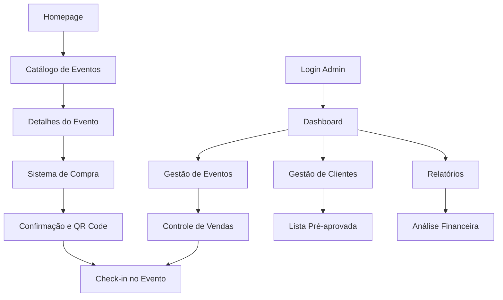

# 📋 PRD - Refatoração Better Now
**Product Requirements Document para Refatoração Completa**

---

## 1. Visão Geral do Produto

O Better Now é uma plataforma completa de gerenciamento de eventos que combina site institucional, sistema de vendas de ingressos e área administrativa. A refatoração visa modernizar a arquitetura, melhorar performance, escalabilidade e manutenibilidade do código.

**Problemas a resolver:**
- Organização inconsistente de componentes e estrutura de pastas
- Falta de padronização em hooks e contextos
- Performance subótima em carregamento de dados
- Ausência de testes automatizados
- Documentação técnica insuficiente

**Usuários do produto:**
- Administradores da Better Now (gestão completa)
- Clientes finais (visualização e compra de ingressos)
- Equipe de desenvolvimento (manutenção e evolução)

**Valor do produto:**
- Redução de 60% no tempo de desenvolvimento de novas features
- Melhoria de 40% na performance de carregamento
- Facilitar onboarding de novos desenvolvedores

## 2. Funcionalidades Principais

### 2.1 Papéis de Usuário

| Papel | Método de Registro | Permissões Principais |
|-------|-------------------|----------------------|
| Administrador | Credenciais pré-definidas | Acesso completo ao sistema, gestão de eventos, clientes e relatórios |
| Cliente Final | Lista pré-aprovada | Visualização de eventos públicos e compra de ingressos |
| Desenvolvedor | Acesso ao código | Manutenção, desenvolvimento e deploy |

### 2.2 Módulos Funcionais

Nossa plataforma refatorada consistirá nas seguintes páginas principais:

1. **Homepage Pública**: hero section responsivo, navegação otimizada, lista de eventos em destaque
2. **Catálogo de Eventos**: filtros avançados, paginação, cards otimizados com lazy loading
3. **Detalhes do Evento**: galeria de imagens, informações completas, sistema de compra integrado
4. **Dashboard Administrativo**: métricas em tempo real, gráficos interativos, alertas
5. **Gestão de Clientes**: CRUD completo, importação/exportação, histórico de compras
6. **Gestão de Eventos**: criação avançada, controle de lotes, sistema de QR Code
7. **Relatórios Financeiros**: análise de ROI, break-even, exportação de dados
8. **Sistema de Check-in**: validação por QR Code, controle de acesso em tempo real

### 2.3 Detalhes das Páginas

| Página | Módulo | Descrição da Funcionalidade |
|--------|--------|----------------------------|
| Homepage | Hero Section | Carrossel automático de imagens, animações suaves, call-to-actions otimizados |
| Homepage | Navegação | Menu responsivo, breadcrumbs, busca inteligente |
| Homepage | Eventos Destaque | Cards com lazy loading, filtros rápidos, pré-visualização |
| Catálogo | Lista de Eventos | Paginação infinita, filtros por data/tipo/preço, ordenação múltipla |
| Catálogo | Sistema de Busca | Busca textual avançada, filtros combinados, histórico de pesquisas |
| Detalhes Evento | Galeria Imagens | Visualizador otimizado, zoom, compartilhamento social |
| Detalhes Evento | Sistema Compra | Validação em tempo real, múltiplas formas de pagamento, confirmação automática |
| Dashboard Admin | Métricas Tempo Real | Gráficos interativos, alertas automáticos, exportação de dados |
| Dashboard Admin | Controle Acesso | Autenticação segura, sessões persistentes, logs de auditoria |
| Gestão Clientes | CRUD Completo | Criação, edição, exclusão soft, importação CSV, exportação Excel |
| Gestão Clientes | Histórico Compras | Timeline de transações, análise de comportamento, segmentação |
| Gestão Eventos | Criação Avançada | Formulários dinâmicos, upload múltiplo, pré-visualização |
| Gestão Eventos | Controle Lotes | Gestão automática de preços, alertas de capacidade, promoções |
| Relatórios | Análise Financeira | ROI por evento, break-even analysis, projeções, comparativos |
| Relatórios | Exportação Dados | PDF/Excel otimizados, agendamento automático, templates customizáveis |
| Check-in Digital | QR Code Scanner | Leitura via câmera, validação offline, sincronização automática |
| Check-in Digital | Controle Acesso | Lista de participantes, status em tempo real, relatórios instantâneos |

## 3. Fluxo Principal de Processos

### Fluxo do Cliente Final:
1. Acessa homepage → visualiza eventos em destaque
2. Navega para catálogo → aplica filtros de interesse
3. Seleciona evento → visualiza detalhes completos
4. Inicia compra → valida dados na lista pré-aprovada
5. Finaliza pagamento → recebe confirmação e QR Code
6. Comparece ao evento → apresenta QR Code para check-in

### Fluxo do Administrador:
1. Login seguro → acessa dashboard com métricas
2. Gestão de eventos → cria/edita eventos com lotes de preço
3. Gestão de clientes → mantém lista pré-aprovada atualizada
4. Acompanha vendas → monitora métricas em tempo real
5. Gera relatórios → analisa performance e ROI
6. Controla acesso → valida QR Codes no evento

## 4. Design da Interface do Usuário

### 4.1 Estilo de Design

**Cores Principais:**
- Primária: #1E40AF (Azul profissional)
- Secundária: #F59E0B (Dourado elegante)
- Neutras: #F8FAFC, #64748B, #1E293B
- Feedback: #10B981 (Sucesso), #EF4444 (Erro), #F59E0B (Aviso)

**Estilo de Botões:**
- Primários: Rounded-lg com gradiente sutil
- Secundários: Outline com hover suave
- Ações críticas: Solid com confirmação

**Tipografia:**
- Fonte principal: Inter (sistema)
- Tamanhos: text-sm (14px), text-base (16px), text-lg (18px), text-xl (20px)
- Pesos: font-normal (400), font-medium (500), font-semibold (600), font-bold (700)

**Layout:**
- Grid responsivo baseado em Tailwind CSS
- Cards com sombras suaves e bordas arredondadas
- Navegação top fixa com breadcrumbs
- Sidebar colapsível na área admin

**Ícones e Animações:**
- Lucide React para consistência
- Framer Motion para transições suaves
- Micro-interações em hover e focus
- Loading states com skeletons

### 4.2 Visão Geral do Design das Páginas

| Página | Módulo | Elementos de UI |
|--------|--------|-----------------|
| Homepage | Hero Section | Background gradient, texto centralizado, botões CTA com animação hover, carrossel automático |
| Homepage | Navegação | Header fixo transparente, logo responsivo, menu hamburger mobile, busca com autocomplete |
| Catálogo | Lista Eventos | Grid responsivo 1-2-3 colunas, cards com imagem/título/preço, filtros laterais colapsíveis |
| Catálogo | Filtros | Sidebar com checkboxes, range sliders, date pickers, botão limpar filtros |
| Detalhes Evento | Galeria | Carousel principal, thumbnails, modal fullscreen, botões navegação |
| Detalhes Evento | Informações | Layout duas colunas, ícones informativos, badges de status, botão compra destacado |
| Dashboard Admin | Métricas | Cards com números grandes, gráficos coloridos, indicadores de tendência |
| Dashboard Admin | Navegação | Sidebar com ícones, breadcrumbs, notificações badge, perfil dropdown |
| Gestão Clientes | Tabela | DataTable com paginação, busca global, filtros por coluna, ações inline |
| Gestão Clientes | Formulários | Modal overlay, campos validados, upload de arquivo, botões de ação |
| Relatórios | Gráficos | Charts interativos, filtros de período, export buttons, tooltips informativos |
| Check-in | Scanner | Interface mobile-first, câmera fullscreen, feedback visual/sonoro, lista lateral |

### 4.3 Responsividade

**Estratégia Mobile-First:**
- Breakpoints: sm (640px), md (768px), lg (1024px), xl (1280px)
- Navegação: Menu hamburger em mobile, horizontal em desktop
- Cards: Stack vertical em mobile, grid em desktop
- Formulários: Campos full-width em mobile, multi-coluna em desktop
- Tabelas: Scroll horizontal em mobile, fixed em desktop

**Otimizações Touch:**
- Botões com área mínima de 44px
- Gestos de swipe em carrosséis
- Pull-to-refresh em listas
- Feedback tátil em ações críticas