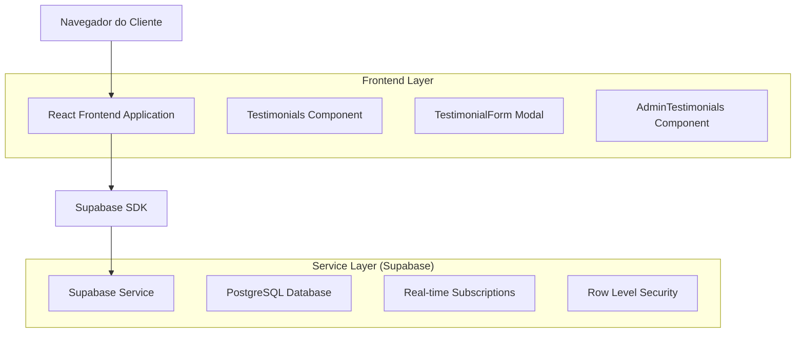
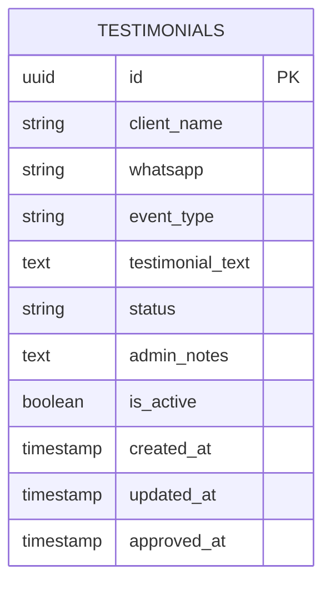

# Sistema de Depoimentos de Clientes - Arquitetura Técnica

## 1. Design da Arquitetura



## 2. Descrição das Tecnologias

* Frontend: React\@18 + tailwindcss\@3 + vite

* Backend: Supabase (PostgreSQL + Real-time + Auth)

* Validação: React Hook Form + Zod

* UI Components: Componentes customizados com Tailwind CSS

## 3. Definições de Rotas

| Rota                | Propósito                                                      |
| ------------------- | -------------------------------------------------------------- |
| /                   | Página principal com seção de depoimentos e botão de submissão |
| /admin/testimonials | Painel administrativo para gerenciar depoimentos               |

## 4. Definições da API

### 4.1 API Principal

**Submissão de Depoimento**

```
POST /api/testimonials (via Supabase SDK)
```

Request:

| Nome do Parâmetro | Tipo   | Obrigatório | Descrição                                    |
| ----------------- | ------ | ----------- | -------------------------------------------- |
| client\_name      | string | true        | Nome completo do cliente                     |
| whatsapp          | string | true        | Número do WhatsApp (formato: +55XXXXXXXXXXX) |
| event\_type       | string | true        | Tipo de evento realizado                     |
| testimonial\_text | string | true        | Texto do depoimento (máx. 500 caracteres)    |

Response:

| Nome do Parâmetro | Tipo    | Descrição               |
| ----------------- | ------- | ----------------------- |
| success           | boolean | Status da operação      |
| message           | string  | Mensagem de confirmação |
| id                | uuid    | ID do depoimento criado |

Exemplo:

```json
{
  "client_name": "Maria Silva",
  "whatsapp": "+5511999999999",
  "event_type": "Casamento",
  "testimonial_text": "Evento perfeito! Superou todas as expectativas."
}
```

**Aprovação de Depoimento (Admin)**

```
PATCH /api/testimonials/:id (via Supabase SDK)
```

Request:

| Nome do Parâmetro | Tipo   | Obrigatório | Descrição                    |
| ----------------- | ------ | ----------- | ---------------------------- |
| status            | string | true        | 'approved', 'rejected'       |
| admin\_notes      | string | false       | Observações do administrador |

**Listagem de Depoimentos Ativos**

```
GET /api/testimonials/active (via Supabase SDK)
```

Response: Array de depoimentos aprovados e ativos

## 5. Modelo de Dados

### 5.1 Definição do Modelo de Dados



### 5.2 Linguagem de Definição de Dados

**Tabela de Depoimentos (testimonials)**

```sql
-- Criar tabela
CREATE TABLE testimonials (
    id UUID PRIMARY KEY DEFAULT gen_random_uuid(),
    client_name VARCHAR(100) NOT NULL,
    whatsapp VARCHAR(20) NOT NULL,
    event_type VARCHAR(50) NOT NULL,
    testimonial_text TEXT NOT NULL CHECK (length(testimonial_text) <= 500),
    status VARCHAR(20) DEFAULT 'pending' CHECK (status IN ('pending', 'approved', 'rejected')),
    admin_notes TEXT,
    is_active BOOLEAN DEFAULT true,
    created_at TIMESTAMP WITH TIME ZONE DEFAULT NOW(),
    updated_at TIMESTAMP WITH TIME ZONE DEFAULT NOW(),
    approved_at TIMESTAMP WITH TIME ZONE
);

-- Criar índices
CREATE INDEX idx_testimonials_status ON testimonials(status);
CREATE INDEX idx_testimonials_active ON testimonials(is_active);
CREATE INDEX idx_testimonials_created_at ON testimonials(created_at DESC);
CREATE INDEX idx_testimonials_approved_at ON testimonials(approved_at DESC);

-- Políticas RLS
ALTER TABLE testimonials ENABLE ROW LEVEL SECURITY;

-- Permitir inserção para usuários anônimos (submissão pública)
CREATE POLICY "Allow public testimonial submission" ON testimonials
    FOR INSERT TO anon
    WITH CHECK (status = 'pending');

-- Permitir leitura de depoimentos aprovados para usuários anônimos
CREATE POLICY "Allow public read approved testimonials" ON testimonials
    FOR SELECT TO anon
    USING (status = 'approved' AND is_active = true);

-- Permitir acesso completo para usuários autenticados (admin)
CREATE POLICY "Allow full access for authenticated users" ON testimonials
    FOR ALL TO authenticated
    USING (true)
    WITH CHECK (true);

-- Dados iniciais (3 depoimentos atuais)
INSERT INTO testimonials (client_name, whatsapp, event_type, testimonial_text, status, is_active, approved_at)
VALUES 
    ('Ana Carolina', '+5511987654321', 'Casamento', 'A Better Now transformou nosso sonho em realidade! Cada detalhe foi pensado com carinho e o resultado superou todas as nossas expectativas. Recomendo de olhos fechados!', 'approved', true, NOW()),
    ('Roberto Santos', '+5511876543210', 'Aniversário', 'Festa incrível! A equipe da Better Now é muito profissional e atenciosa. Nossos convidados não pararam de elogiar a decoração e organização. Parabéns pelo excelente trabalho!', 'approved', true, NOW()),
    ('Mariana Costa', '+5511765432109', 'Formatura', 'Evento perfeito do início ao fim! A Better Now cuidou de todos os detalhes e pudemos aproveitar nossa formatura sem preocupações. Equipe nota 10!', 'approved', true, NOW());

-- Trigger para atualizar updated_at
CREATE OR REPLACE FUNCTION update_updated_at_column()
RETURNS TRIGGER AS $$
BEGIN
    NEW.updated_at = NOW();
    RETURN NEW;
END;
$$ language 'plpgsql';

CREATE TRIGGER update_testimonials_updated_at
    BEFORE UPDATE ON testimonials
    FOR EACH ROW
    EXECUTE FUNCTION update_updated_at_column();

-- Trigger para definir approved_at quando status muda para 'approved'
CREATE OR REPLACE FUNCTION set_approved_at()
RETURNS TRIGGER AS $$
BEGIN
    IF NEW.status = 'approved' AND OLD.status != 'approved' THEN
        NEW.approved_at = NOW();
    ELSIF NEW.status != 'approved' THEN
        NEW.approved_at = NULL;
    END IF;
    RETURN NEW;
END;
$$ language 'plpgsql';

CREATE TRIGGER set_testimonials_approved_at
    BEFORE UPDATE ON testimonials
    FOR EACH ROW
    EXECUTE FUNCTION set_approved_at();
```

## 6. Componentes e Hooks

### 6.1 Componentes React

* **TestimonialSubmissionButton**: Botão discreto na seção de depoimentos

* **TestimonialFormModal**: Modal com formulário de submissão

* **TestimonialsSection**: Seção atualizada que busca depoimentos do Supabase

* **AdminTestimonials**: Painel administrativo para moderação

### 6.2 Hooks Customizados

* **useSupabaseTestimonials**: Hook para operações CRUD de depoimentos

* **useTestimonialSubmission**: Hook para submissão de novos depoimentos

* **useTestimonialModeration**: Hook para aprovação/rejeição (admin)

### 6.3 Validação de Dados

```typescript
// Schema de validação com Zod
const testimonialSchema = z.object({
  client_name: z.string().min(2, 'Nome deve ter pelo menos 2 caracteres').max(100),
  whatsapp: z.string().regex(/^\+55\d{10,11}$/, 'WhatsApp deve estar no formato +55XXXXXXXXXXX'),
  event_type: z.string().min(1, 'Tipo de evento é obrigatório').max(50),
  testimonial_text: z.string().min(10, 'Depoimento deve ter pelo menos 10 caracteres').max(500)
});
```

