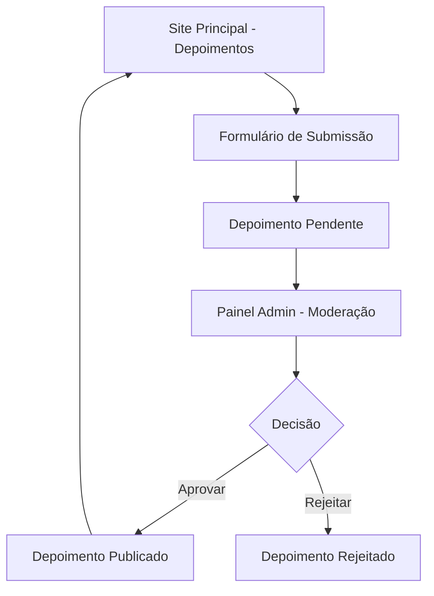

# Sistema de Depoimentos de Clientes - PRD

## 1. Visão Geral do Produto

Sistema para coleta, moderação e exibição de depoimentos de clientes no site Better Now, permitindo que clientes compartilhem suas experiências com eventos realizados.

O sistema resolve a necessidade de automatizar a coleta de feedback dos clientes e criar um processo estruturado de aprovação antes da publicação, mantendo a qualidade e autenticidade dos depoimentos exibidos.

## 2. Funcionalidades Principais

### 2.1 Papéis de Usuário

| Papel | Método de Acesso | Permissões Principais |
|-------|------------------|----------------------|
| Cliente | Acesso público ao formulário | Pode submeter novos depoimentos |
| Administrador | Login no painel admin | Pode aprovar, rejeitar e gerenciar depoimentos |

### 2.2 Módulos Funcionais

O sistema de depoimentos consiste nas seguintes páginas principais:

1. **Seção de Depoimentos (Site Principal)**: exibição dos depoimentos aprovados, botão discreto para novo depoimento
2. **Formulário de Submissão**: coleta de dados do cliente e depoimento
3. **Painel Administrativo**: gerenciamento e moderação de depoimentos

### 2.3 Detalhes das Páginas

| Nome da Página | Nome do Módulo | Descrição da Funcionalidade |
|----------------|----------------|-----------------------------|
| Seção de Depoimentos | Exibição de Depoimentos | Mostrar depoimentos aprovados no layout atual, botão discreto "+ Compartilhe sua experiência" |
| Seção de Depoimentos | Formulário de Submissão | Coletar nome, WhatsApp, tipo de evento e depoimento do cliente |
| Painel Admin | Lista de Depoimentos | Visualizar todos os depoimentos (pendentes, aprovados, rejeitados) com filtros |
| Painel Admin | Moderação | Aprovar, rejeitar ou editar depoimentos antes da publicação |
| Painel Admin | Gerenciamento | Ativar/desativar depoimentos publicados, excluir permanentemente |

## 3. Processo Principal

**Fluxo do Cliente:**
1. Cliente acessa a seção de depoimentos no site
2. Clica no botão discreto "+ Compartilhe sua experiência"
3. Preenche formulário com dados obrigatórios
4. Submete depoimento para análise
5. Recebe confirmação de envio

**Fluxo do Administrador:**
1. Acessa painel administrativo
2. Visualiza depoimentos pendentes de aprovação
3. Analisa conteúdo e dados do cliente
4. Aprova, rejeita ou solicita edições
5. Depoimentos aprovados aparecem automaticamente no site

## 4. Design da Interface

### 4.1 Estilo de Design

- **Cores primárias**: Manter paleta atual do site (azul #2563eb, branco, cinza)
- **Estilo dos botões**: Botão discreto com ícone de "+" e texto sutil
- **Fonte**: Manter tipografia atual do site
- **Layout**: Integração harmoniosa com seção existente de depoimentos
- **Ícones**: Usar ícones de estrelas, comentários e aprovação

### 4.2 Visão Geral do Design das Páginas

| Nome da Página | Nome do Módulo | Elementos da UI |
|----------------|----------------|----------------|
| Seção de Depoimentos | Botão de Submissão | Botão discreto posicionado no canto inferior direito da seção, cor sutil, hover com destaque |
| Formulário de Submissão | Modal de Depoimento | Modal responsivo, campos organizados verticalmente, validação em tempo real, botão de envio destacado |
| Painel Admin | Lista de Depoimentos | Tabela com colunas: nome, evento, status, data, ações; filtros por status; paginação |
| Painel Admin | Moderação | Preview do depoimento, dados do cliente, botões de ação (aprovar/rejeitar), campo para observações |

### 4.3 Responsividade

O sistema será mobile-first com adaptação para desktop, otimizado para interação touch no formulário de submissão.