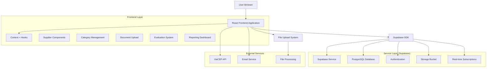
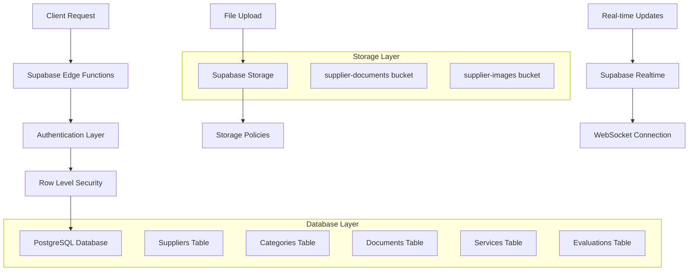
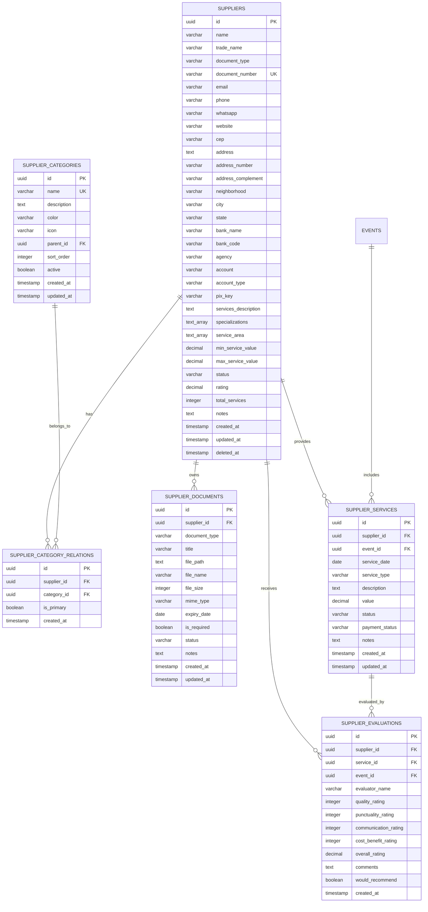

# 🏗️ Arquitetura Técnica - Sistema de Gestão de Fornecedores

## 1. Arquitetura do Sistema



## 2. Descrição Tecnológica

- **Frontend**: React@19.1.1 + TypeScript@5.8.2 + Tailwind CSS@4.1.13 + Vite@6.2.0
- **Backend**: Supabase (PostgreSQL + Auth + Storage + Real-time)
- **Gerenciamento de Estado**: React Context + Custom Hooks
- **Validação**: React Hook Form@7.63.0 + Zod@4.1.11
- **Upload de Arquivos**: Supabase Storage + React Dropzone
- **Ícones**: Lucide React@0.544.0
- **Notificações**: Sonner@2.0.7

## 3. Definições de Rotas

| Rota | Propósito |
|------|-----------|
| `/admin/fornecedores` | Dashboard principal de fornecedores com estatísticas e visão geral |
| `/admin/fornecedores/cadastro` | Formulário de cadastro/edição de fornecedores |
| `/admin/fornecedores/lista` | Listagem completa com filtros e busca avançada |
| `/admin/fornecedores/:id` | Perfil detalhado do fornecedor com abas |
| `/admin/fornecedores/categorias` | Gestão de categorias de fornecedores |
| `/admin/fornecedores/documentos` | Biblioteca de documentos e contratos |
| `/admin/fornecedores/avaliacoes` | Sistema de avaliações e feedback |
| `/admin/fornecedores/relatorios` | Relatórios e análises de desempenho |

## 4. Definições de API (Supabase)

### 4.1 Core API - Fornecedores

**Listar Fornecedores**
```typescript
supabase
  .from('suppliers')
  .select(`
    *,
    supplier_category_relations(
      supplier_categories(id, name, color, icon)
    )
  `)
  .eq('deleted_at', null)
  .order('created_at', { ascending: false })
```

**Buscar Fornecedor por ID**
```typescript
supabase
  .from('suppliers')
  .select(`
    *,
    supplier_category_relations(
      supplier_categories(*)
    ),
    supplier_documents(*),
    supplier_services(
      *,
      events(name, event_date)
    ),
    supplier_evaluations(*)
  `)
  .eq('id', supplierId)
  .single()
```

**Criar/Atualizar Fornecedor**
```typescript
// Criar
supabase
  .from('suppliers')
  .insert({
    name: string,
    trade_name: string,
    document_type: 'CPF' | 'CNPJ',
    document_number: string,
    email: string,
    phone: string,
    whatsapp: string,
    // ... outros campos
  })

// Atualizar
supabase
  .from('suppliers')
  .update(supplierData)
  .eq('id', supplierId)
```

### 4.2 API - Categorias

**Listar Categorias**
```typescript
supabase
  .from('supplier_categories')
  .select('*')
  .eq('active', true)
  .order('sort_order', { ascending: true })
```

**Gerenciar Relações Fornecedor-Categoria**
```typescript
// Adicionar categoria ao fornecedor
supabase
  .from('supplier_category_relations')
  .insert({
    supplier_id: string,
    category_id: string,
    is_primary: boolean
  })

// Remover categoria do fornecedor
supabase
  .from('supplier_category_relations')
  .delete()
  .eq('supplier_id', supplierId)
  .eq('category_id', categoryId)
```

### 4.3 API - Documentos

**Upload de Documento**
```typescript
// Upload do arquivo
const { data: fileData, error: uploadError } = await supabase.storage
  .from('supplier-documents')
  .upload(`${supplierId}/${fileName}`, file)

// Registrar no banco
supabase
  .from('supplier_documents')
  .insert({
    supplier_id: string,
    document_type: string,
    title: string,
    file_path: string,
    file_name: string,
    file_size: number,
    mime_type: string,
    expiry_date: string
  })
```

**Listar Documentos do Fornecedor**
```typescript
supabase
  .from('supplier_documents')
  .select('*')
  .eq('supplier_id', supplierId)
  .order('created_at', { ascending: false })
```

### 4.4 API - Avaliações

**Criar Avaliação**
```typescript
supabase
  .from('supplier_evaluations')
  .insert({
    supplier_id: string,
    service_id: string,
    event_id: string,
    evaluator_name: string,
    quality_rating: number,
    punctuality_rating: number,
    communication_rating: number,
    cost_benefit_rating: number,
    overall_rating: number,
    comments: string,
    would_recommend: boolean
  })
```

**Buscar Avaliações do Fornecedor**
```typescript
supabase
  .from('supplier_evaluations')
  .select(`
    *,
    supplier_services(description, service_date),
    events(name, event_date)
  `)
  .eq('supplier_id', supplierId)
  .order('created_at', { ascending: false })
```

### 4.5 Tipos TypeScript Compartilhados

```typescript
// Tipos de Fornecedor
interface Supplier {
  id: string;
  name: string;
  trade_name?: string;
  document_type: 'CPF' | 'CNPJ';
  document_number: string;
  email?: string;
  phone?: string;
  whatsapp?: string;
  website?: string;
  
  // Endereço
  cep?: string;
  address?: string;
  address_number?: string;
  address_complement?: string;
  neighborhood?: string;
  city?: string;
  state?: string;
  
  // Dados bancários
  bank_name?: string;
  bank_code?: string;
  agency?: string;
  account?: string;
  account_type?: 'corrente' | 'poupanca';
  pix_key?: string;
  
  // Informações comerciais
  services_description?: string;
  specializations?: string[];
  service_area?: string[];
  min_service_value?: number;
  max_service_value?: number;
  
  // Status e controle
  status: 'active' | 'inactive' | 'blocked';
  rating: number;
  total_services: number;
  notes?: string;
  
  // Auditoria
  created_at: string;
  updated_at: string;
  deleted_at?: string;
}

// Tipos de Categoria
interface SupplierCategory {
  id: string;
  name: string;
  description?: string;
  color: string;
  icon: string;
  parent_id?: string;
  sort_order: number;
  active: boolean;
  created_at: string;
  updated_at: string;
}

// Tipos de Documento
interface SupplierDocument {
  id: string;
  supplier_id: string;
  document_type: 'contract' | 'certificate' | 'license' | 'insurance';
  title: string;
  file_path: string;
  file_name: string;
  file_size: number;
  mime_type: string;
  expiry_date?: string;
  is_required: boolean;
  status: 'valid' | 'expired' | 'pending';
  notes?: string;
  created_at: string;
  updated_at: string;
}

// Tipos de Serviço
interface SupplierService {
  id: string;
  supplier_id: string;
  event_id?: string;
  service_date: string;
  service_type?: string;
  description?: string;
  value?: number;
  status: 'scheduled' | 'in_progress' | 'completed' | 'cancelled';
  payment_status: 'pending' | 'paid' | 'overdue';
  notes?: string;
  created_at: string;
  updated_at: string;
}

// Tipos de Avaliação
interface SupplierEvaluation {
  id: string;
  supplier_id: string;
  service_id?: string;
  event_id?: string;
  evaluator_name?: string;
  quality_rating: number;
  punctuality_rating: number;
  communication_rating: number;
  cost_benefit_rating: number;
  overall_rating: number;
  comments?: string;
  would_recommend: boolean;
  created_at: string;
}

// Tipos de Filtros
interface SupplierFilters {
  categories?: string[];
  status?: string;
  city?: string;
  state?: string;
  min_rating?: number;
  has_documents?: boolean;
  service_area?: string[];
  price_range?: {
    min?: number;
    max?: number;
  };
}

// Tipos de Busca
interface SupplierSearchParams {
  query?: string;
  filters?: SupplierFilters;
  sort_by?: 'name' | 'rating' | 'created_at' | 'total_services';
  sort_order?: 'asc' | 'desc';
  page?: number;
  limit?: number;
}
```

## 5. Arquitetura do Servidor (Supabase)



## 6. Modelo de Dados

### 6.1 Diagrama de Entidade-Relacionamento



### 6.2 Linguagem de Definição de Dados (DDL)

**Tabela de Fornecedores (suppliers)**
```sql
-- Criar tabela de fornecedores
CREATE TABLE suppliers (
  id UUID DEFAULT gen_random_uuid() PRIMARY KEY,
  name VARCHAR(255) NOT NULL,
  trade_name VARCHAR(255),
  document_type VARCHAR(10) CHECK (document_type IN ('CPF', 'CNPJ')),
  document_number VARCHAR(20) UNIQUE,
  email VARCHAR(255),
  phone VARCHAR(20),
  whatsapp VARCHAR(20),
  website VARCHAR(255),
  
  -- Endereço
  cep VARCHAR(10),
  address TEXT,
  address_number VARCHAR(20),
  address_complement VARCHAR(100),
  neighborhood VARCHAR(100),
  city VARCHAR(100),
  state VARCHAR(2),
  
  -- Dados bancários
  bank_name VARCHAR(100),
  bank_code VARCHAR(10),
  agency VARCHAR(20),
  account VARCHAR(20),
  account_type VARCHAR(20) CHECK (account_type IN ('corrente', 'poupanca')),
  pix_key VARCHAR(255),
  
  -- Informações comerciais
  services_description TEXT,
  specializations TEXT[],
  service_area TEXT[],
  min_service_value DECIMAL(10,2),
  max_service_value DECIMAL(10,2),
  
  -- Status e controle
  status VARCHAR(20) DEFAULT 'active' CHECK (status IN ('active', 'inactive', 'blocked')),
  rating DECIMAL(3,2) DEFAULT 0.00,
  total_services INTEGER DEFAULT 0,
  notes TEXT,
  
  -- Auditoria
  created_at TIMESTAMP WITH TIME ZONE DEFAULT NOW(),
  updated_at TIMESTAMP WITH TIME ZONE DEFAULT NOW(),
  deleted_at TIMESTAMP WITH TIME ZONE
);

-- Criar índices
CREATE INDEX idx_suppliers_status ON suppliers(status);
CREATE INDEX idx_suppliers_document ON suppliers(document_number);
CREATE INDEX idx_suppliers_rating ON suppliers(rating DESC);
CREATE INDEX idx_suppliers_city ON suppliers(city);
CREATE INDEX idx_suppliers_deleted ON suppliers(deleted_at);

-- Trigger para updated_at
CREATE TRIGGER update_suppliers_updated_at 
  BEFORE UPDATE ON suppliers
  FOR EACH ROW EXECUTE FUNCTION update_updated_at_column();
```

**Tabela de Categorias (supplier_categories)**
```sql
-- Criar tabela de categorias
CREATE TABLE supplier_categories (
  id UUID DEFAULT gen_random_uuid() PRIMARY KEY,
  name VARCHAR(100) NOT NULL UNIQUE,
  description TEXT,
  color VARCHAR(7) DEFAULT '#3B82F6',
  icon VARCHAR(50) DEFAULT 'Package',
  parent_id UUID REFERENCES supplier_categories(id),
  sort_order INTEGER DEFAULT 0,
  active BOOLEAN DEFAULT true,
  created_at TIMESTAMP WITH TIME ZONE DEFAULT NOW(),
  updated_at TIMESTAMP WITH TIME ZONE DEFAULT NOW()
);

-- Criar índices
CREATE INDEX idx_supplier_categories_active ON supplier_categories(active);
CREATE INDEX idx_supplier_categories_parent ON supplier_categories(parent_id);
CREATE INDEX idx_supplier_categories_sort ON supplier_categories(sort_order);

-- Trigger para updated_at
CREATE TRIGGER update_supplier_categories_updated_at 
  BEFORE UPDATE ON supplier_categories
  FOR EACH ROW EXECUTE FUNCTION update_updated_at_column();

-- Dados iniciais
INSERT INTO supplier_categories (name, description, color, icon, sort_order) VALUES
('Alimentação', 'Fornecedores de comidas e bebidas', '#10B981', 'UtensilsCrossed', 1),
('Decoração', 'Decoração e ambientação de eventos', '#F59E0B', 'Palette', 2),
('Som e Iluminação', 'Equipamentos audiovisuais', '#8B5CF6', 'Volume2', 3),
('Segurança', 'Serviços de segurança e portaria', '#EF4444', 'Shield', 4),
('Limpeza', 'Serviços de limpeza e manutenção', '#06B6D4', 'Sparkles', 5),
('Transporte', 'Transporte e logística', '#F97316', 'Truck', 6),
('Fotografia', 'Fotografia e filmagem', '#EC4899', 'Camera', 7),
('Entretenimento', 'Shows, música e animação', '#84CC16', 'Music', 8);
```

**Tabela de Relações (supplier_category_relations)**
```sql
-- Criar tabela de relações fornecedor-categoria
CREATE TABLE supplier_category_relations (
  id UUID DEFAULT gen_random_uuid() PRIMARY KEY,
  supplier_id UUID NOT NULL REFERENCES suppliers(id) ON DELETE CASCADE,
  category_id UUID NOT NULL REFERENCES supplier_categories(id) ON DELETE CASCADE,
  is_primary BOOLEAN DEFAULT false,
  created_at TIMESTAMP WITH TIME ZONE DEFAULT NOW(),
  UNIQUE(supplier_id, category_id)
);

-- Criar índices
CREATE INDEX idx_supplier_category_relations_supplier ON supplier_category_relations(supplier_id);
CREATE INDEX idx_supplier_category_relations_category ON supplier_category_relations(category_id);
CREATE INDEX idx_supplier_category_relations_primary ON supplier_category_relations(is_primary);
```

**Tabela de Documentos (supplier_documents)**
```sql
-- Criar tabela de documentos
CREATE TABLE supplier_documents (
  id UUID DEFAULT gen_random_uuid() PRIMARY KEY,
  supplier_id UUID NOT NULL REFERENCES suppliers(id) ON DELETE CASCADE,
  document_type VARCHAR(50) NOT NULL,
  title VARCHAR(255) NOT NULL,
  file_path TEXT NOT NULL,
  file_name VARCHAR(255) NOT NULL,
  file_size INTEGER,
  mime_type VARCHAR(100),
  expiry_date DATE,
  is_required BOOLEAN DEFAULT false,
  status VARCHAR(20) DEFAULT 'valid' CHECK (status IN ('valid', 'expired', 'pending')),
  notes TEXT,
  created_at TIMESTAMP WITH TIME ZONE DEFAULT NOW(),
  updated_at TIMESTAMP WITH TIME ZONE DEFAULT NOW()
);

-- Criar índices
CREATE INDEX idx_supplier_documents_supplier ON supplier_documents(supplier_id);
CREATE INDEX idx_supplier_documents_expiry ON supplier_documents(expiry_date);
CREATE INDEX idx_supplier_documents_status ON supplier_documents(status);
CREATE INDEX idx_supplier_documents_type ON supplier_documents(document_type);

-- Trigger para updated_at
CREATE TRIGGER update_supplier_documents_updated_at 
  BEFORE UPDATE ON supplier_documents
  FOR EACH ROW EXECUTE FUNCTION update_updated_at_column();
```

**Configuração de Storage**
```sql
-- Criar buckets no Supabase Storage
INSERT INTO storage.buckets (id, name, public) VALUES 
('supplier-documents', 'supplier-documents', false),
('supplier-images', 'supplier-images', true);

-- Políticas de acesso para documentos
CREATE POLICY "Authenticated users can upload supplier documents" ON storage.objects
  FOR INSERT TO authenticated WITH CHECK (bucket_id = 'supplier-documents');

CREATE POLICY "Authenticated users can view supplier documents" ON storage.objects
  FOR SELECT TO authenticated USING (bucket_id = 'supplier-documents');

CREATE POLICY "Authenticated users can delete supplier documents" ON storage.objects
  FOR DELETE TO authenticated USING (bucket_id = 'supplier-documents');

-- Políticas de acesso para imagens (públicas)
CREATE POLICY "Anyone can view supplier images" ON storage.objects
  FOR SELECT USING (bucket_id = 'supplier-images');

CREATE POLICY "Authenticated users can upload supplier images" ON storage.objects
  FOR INSERT TO authenticated WITH CHECK (bucket_id = 'supplier-images');
```

**Políticas RLS (Row Level Security)**
```sql
-- Habilitar RLS
ALTER TABLE suppliers ENABLE ROW LEVEL SECURITY;
ALTER TABLE supplier_categories ENABLE ROW LEVEL SECURITY;
ALTER TABLE supplier_category_relations ENABLE ROW LEVEL SECURITY;
ALTER TABLE supplier_documents ENABLE ROW LEVEL SECURITY;
ALTER TABLE supplier_services ENABLE ROW LEVEL SECURITY;
ALTER TABLE supplier_evaluations ENABLE ROW LEVEL SECURITY;

-- Políticas para usuários autenticados (administradores)
CREATE POLICY "Authenticated users can manage suppliers" ON suppliers
  FOR ALL TO authenticated USING (true);

CREATE POLICY "Authenticated users can manage categories" ON supplier_categories
  FOR ALL TO authenticated USING (true);

CREATE POLICY "Authenticated users can manage relations" ON supplier_category_relations
  FOR ALL TO authenticated USING (true);

CREATE POLICY "Authenticated users can manage documents" ON supplier_documents
  FOR ALL TO authenticated USING (true);

CREATE POLICY "Authenticated users can manage services" ON supplier_services
  FOR ALL TO authenticated USING (true);

CREATE POLICY "Authenticated users can manage evaluations" ON supplier_evaluations
  FOR ALL TO authenticated USING (true);

-- Políticas para usuários anônimos (se necessário)
CREATE POLICY "Public can view active suppliers" ON suppliers
  FOR SELECT TO anon USING (status = 'active' AND deleted_at IS NULL);

CREATE POLICY "Public can view active categories" ON supplier_categories
  FOR SELECT TO anon USING (active = true);
```