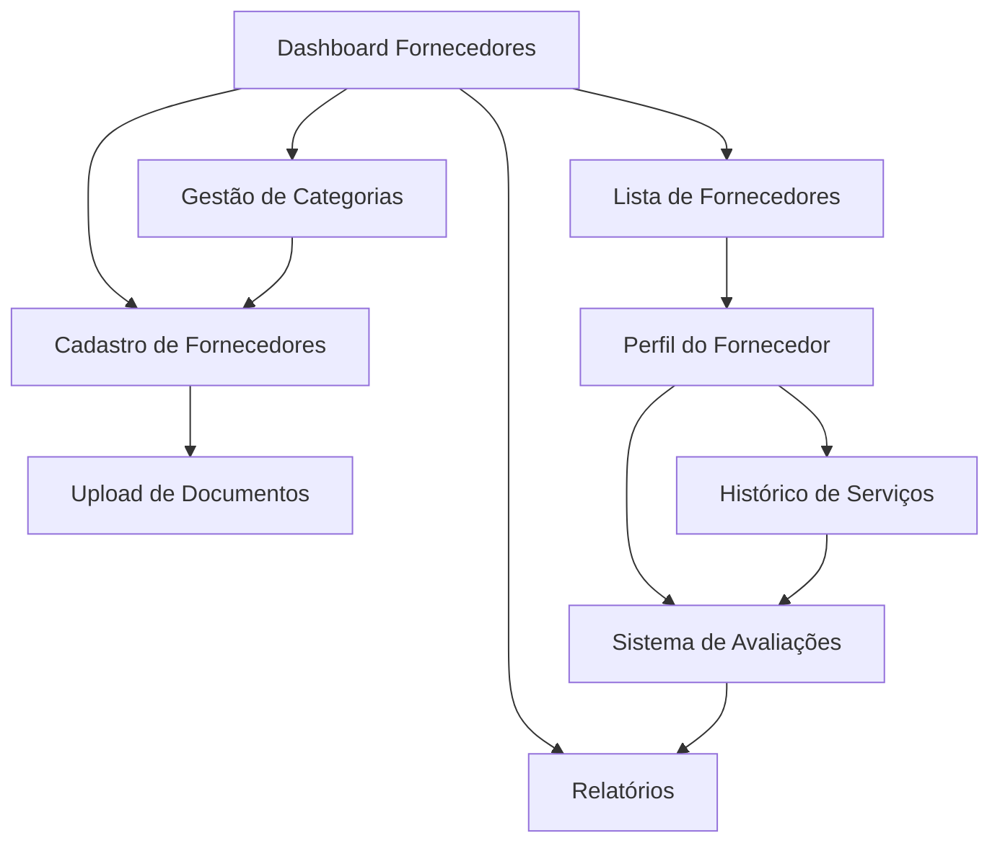

# 📋 PRD - Sistema de Gestão de Fornecedores - Better Now

## 1. Visão Geral do Produto

O Sistema de Gestão de Fornecedores é uma extensão da plataforma Better Now que permite o cadastro, categorização e gerenciamento completo de fornecedores para organização de eventos. O sistema oferece controle total sobre parceiros comerciais, incluindo dados bancários, documentação, histórico de serviços e avaliações de desempenho.

- **Objetivo Principal**: Centralizar e organizar informações de fornecedores para facilitar a gestão de eventos e parcerias comerciais.
- **Público-Alvo**: Administradores da plataforma Better Now responsáveis pela organização de eventos e gestão de fornecedores.
- **Valor de Mercado**: Otimização de processos administrativos, redução de tempo na seleção de fornecedores e melhoria na qualidade dos serviços contratados.

## 2. Funcionalidades Principais

### 2.1 Papéis de Usuário

| Papel | Método de Acesso | Permissões Principais |
|-------|------------------|----------------------|
| Administrador | Login com credenciais administrativas | Acesso completo: criar, editar, excluir fornecedores e categorias |
| Usuário Visualizador | Convite do administrador | Apenas visualização de fornecedores e relatórios |

### 2.2 Módulos de Funcionalidades

O sistema de gestão de fornecedores será composto pelas seguintes páginas principais:

1. **Dashboard de Fornecedores**: visão geral, estatísticas, fornecedores em destaque
2. **Cadastro de Fornecedores**: formulário completo de registro e edição
3. **Gestão de Categorias**: criação e organização de categorias de serviços
4. **Biblioteca de Documentos**: upload e organização de contratos e documentos
5. **Histórico e Avaliações**: registro de serviços prestados e feedback
6. **Relatórios**: análises de desempenho e custos

### 2.3 Detalhes das Páginas

| Nome da Página | Módulo | Descrição da Funcionalidade |
|----------------|--------|----------------------------|
| Dashboard de Fornecedores | Visão Geral | Exibir estatísticas gerais, fornecedores ativos, categorias mais utilizadas, alertas de documentos vencidos |
| Cadastro de Fornecedores | Formulário Principal | Criar e editar fornecedores com informações básicas, contato, dados bancários, especializações e documentos |
| Gestão de Categorias | Sistema de Categorização | Criar, editar e excluir categorias de fornecedores, definir cores e ícones, gerenciar hierarquias |
| Lista de Fornecedores | Visualização e Filtros | Listar fornecedores com busca avançada, filtros por categoria, status, localização e avaliação |
| Perfil do Fornecedor | Detalhes Completos | Visualizar informações completas, histórico de serviços, documentos, avaliações e contatos |
| Biblioteca de Documentos | Gestão de Arquivos | Upload, organização e controle de vencimento de contratos, certificados e documentos |
| Histórico de Serviços | Registro de Atividades | Registrar serviços prestados, vincular a eventos, adicionar observações e custos |
| Sistema de Avaliações | Feedback e Qualidade | Avaliar fornecedores por evento, registrar feedback, calcular médias de desempenho |
| Relatórios | Análises e Métricas | Gerar relatórios de custos, desempenho, frequência de uso e análises comparativas |

## 3. Fluxo Principal de Processos

### Fluxo do Administrador:
1. Acessa o dashboard de fornecedores
2. Cria/gerencia categorias de serviços
3. Cadastra novos fornecedores com informações completas
4. Faz upload de documentos e contratos
5. Vincula fornecedores a eventos específicos
6. Registra avaliações pós-evento
7. Gera relatórios de desempenho

### Fluxo de Seleção de Fornecedores:
1. Filtra fornecedores por categoria e localização
2. Analisa histórico e avaliações
3. Verifica documentação e certificações
4. Solicita orçamentos
5. Registra contratação no sistema



## 4. Design da Interface do Usuário

### 4.1 Estilo de Design

- **Cores Primárias**: Azul (#3B82F6) e Branco (#FFFFFF)
- **Cores Secundárias**: Cinza (#6B7280) e Verde (#10B981) para status positivos
- **Estilo de Botões**: Arredondados com sombra sutil, efeitos hover suaves
- **Tipografia**: Inter ou system fonts, tamanhos 14px (corpo), 16px (títulos), 24px (cabeçalhos)
- **Layout**: Design baseado em cards, navegação lateral fixa, breadcrumbs
- **Ícones**: Lucide React para consistência com o sistema existente
- **Animações**: Transições suaves de 200ms, loading states com spinners

### 4.2 Visão Geral do Design das Páginas

| Nome da Página | Módulo | Elementos de UI |
|----------------|--------|-----------------|
| Dashboard Fornecedores | Visão Geral | Cards de estatísticas, gráficos de pizza, lista de fornecedores recentes, alertas coloridos |
| Cadastro de Fornecedores | Formulário | Formulário multi-etapas, upload de arquivos drag-and-drop, seleção múltipla de categorias |
| Gestão de Categorias | Categorização | Tabela editável inline, seletor de cores, preview de ícones, drag-and-drop para ordenação |
| Lista de Fornecedores | Listagem | Tabela responsiva, filtros laterais, busca em tempo real, badges de status |
| Perfil do Fornecedor | Detalhes | Layout em abas, timeline de histórico, galeria de documentos, gráficos de avaliação |
| Biblioteca de Documentos | Arquivos | Grid de documentos, preview modal, indicadores de vencimento, filtros por tipo |
| Histórico de Serviços | Timeline | Lista cronológica, cards de eventos, badges de status, links para detalhes |
| Sistema de Avaliações | Feedback | Formulário de avaliação, sistema de estrelas, comentários, médias visuais |
| Relatórios | Analytics | Gráficos interativos, filtros de período, exportação PDF/Excel, comparativos |

### 4.3 Responsividade

- **Desktop-first**: Otimizado para telas de 1024px ou maiores
- **Adaptação Mobile**: Layout em coluna única, navegação em hambúrguer, formulários simplificados
- **Interação Touch**: Botões com área mínima de 44px, gestos de swipe para navegação

## 5. Especificações Técnicas

### 5.1 Estrutura de Dados

#### Tabela: suppliers (fornecedores)
```sql
CREATE TABLE suppliers (
  id UUID DEFAULT gen_random_uuid() PRIMARY KEY,
  name VARCHAR(255) NOT NULL,
  trade_name VARCHAR(255), -- Nome fantasia
  document_type VARCHAR(10) CHECK (document_type IN ('CPF', 'CNPJ')),
  document_number VARCHAR(20) UNIQUE,
  email VARCHAR(255),
  phone VARCHAR(20),
  whatsapp VARCHAR(20),
  website VARCHAR(255),
  
  -- Endereço
  cep VARCHAR(10),
  address TEXT,
  address_number VARCHAR(20),
  address_complement VARCHAR(100),
  neighborhood VARCHAR(100),
  city VARCHAR(100),
  state VARCHAR(2),
  
  -- Dados bancários
  bank_name VARCHAR(100),
  bank_code VARCHAR(10),
  agency VARCHAR(20),
  account VARCHAR(20),
  account_type VARCHAR(20) CHECK (account_type IN ('corrente', 'poupanca')),
  pix_key VARCHAR(255),
  
  -- Informações comerciais
  services_description TEXT,
  specializations TEXT[],
  service_area TEXT[], -- Cidades/regiões que atende
  min_service_value DECIMAL(10,2),
  max_service_value DECIMAL(10,2),
  
  -- Status e controle
  status VARCHAR(20) DEFAULT 'active' CHECK (status IN ('active', 'inactive', 'blocked')),
  rating DECIMAL(3,2) DEFAULT 0.00, -- Média de avaliações
  total_services INTEGER DEFAULT 0,
  notes TEXT,
  
  -- Auditoria
  created_at TIMESTAMP WITH TIME ZONE DEFAULT NOW(),
  updated_at TIMESTAMP WITH TIME ZONE DEFAULT NOW(),
  deleted_at TIMESTAMP WITH TIME ZONE
);
```

#### Tabela: supplier_categories (categorias de fornecedores)
```sql
CREATE TABLE supplier_categories (
  id UUID DEFAULT gen_random_uuid() PRIMARY KEY,
  name VARCHAR(100) NOT NULL UNIQUE,
  description TEXT,
  color VARCHAR(7) DEFAULT '#3B82F6',
  icon VARCHAR(50) DEFAULT 'Package',
  parent_id UUID REFERENCES supplier_categories(id),
  sort_order INTEGER DEFAULT 0,
  active BOOLEAN DEFAULT true,
  created_at TIMESTAMP WITH TIME ZONE DEFAULT NOW(),
  updated_at TIMESTAMP WITH TIME ZONE DEFAULT NOW()
);
```

#### Tabela: supplier_category_relations (relação fornecedor-categoria)
```sql
CREATE TABLE supplier_category_relations (
  id UUID DEFAULT gen_random_uuid() PRIMARY KEY,
  supplier_id UUID NOT NULL REFERENCES suppliers(id) ON DELETE CASCADE,
  category_id UUID NOT NULL REFERENCES supplier_categories(id) ON DELETE CASCADE,
  is_primary BOOLEAN DEFAULT false,
  created_at TIMESTAMP WITH TIME ZONE DEFAULT NOW(),
  UNIQUE(supplier_id, category_id)
);
```

#### Tabela: supplier_documents (documentos dos fornecedores)
```sql
CREATE TABLE supplier_documents (
  id UUID DEFAULT gen_random_uuid() PRIMARY KEY,
  supplier_id UUID NOT NULL REFERENCES suppliers(id) ON DELETE CASCADE,
  document_type VARCHAR(50) NOT NULL, -- 'contract', 'certificate', 'license', 'insurance'
  title VARCHAR(255) NOT NULL,
  file_path TEXT NOT NULL,
  file_name VARCHAR(255) NOT NULL,
  file_size INTEGER,
  mime_type VARCHAR(100),
  expiry_date DATE,
  is_required BOOLEAN DEFAULT false,
  status VARCHAR(20) DEFAULT 'valid' CHECK (status IN ('valid', 'expired', 'pending')),
  notes TEXT,
  created_at TIMESTAMP WITH TIME ZONE DEFAULT NOW(),
  updated_at TIMESTAMP WITH TIME ZONE DEFAULT NOW()
);
```

#### Tabela: supplier_services (histórico de serviços)
```sql
CREATE TABLE supplier_services (
  id UUID DEFAULT gen_random_uuid() PRIMARY KEY,
  supplier_id UUID NOT NULL REFERENCES suppliers(id) ON DELETE CASCADE,
  event_id UUID REFERENCES events(id) ON DELETE SET NULL,
  service_date DATE NOT NULL,
  service_type VARCHAR(100),
  description TEXT,
  value DECIMAL(10,2),
  status VARCHAR(20) DEFAULT 'completed' CHECK (status IN ('scheduled', 'in_progress', 'completed', 'cancelled')),
  payment_status VARCHAR(20) DEFAULT 'pending' CHECK (payment_status IN ('pending', 'paid', 'overdue')),
  notes TEXT,
  created_at TIMESTAMP WITH TIME ZONE DEFAULT NOW(),
  updated_at TIMESTAMP WITH TIME ZONE DEFAULT NOW()
);
```

#### Tabela: supplier_evaluations (avaliações dos fornecedores)
```sql
CREATE TABLE supplier_evaluations (
  id UUID DEFAULT gen_random_uuid() PRIMARY KEY,
  supplier_id UUID NOT NULL REFERENCES suppliers(id) ON DELETE CASCADE,
  service_id UUID REFERENCES supplier_services(id) ON DELETE CASCADE,
  event_id UUID REFERENCES events(id) ON DELETE SET NULL,
  evaluator_name VARCHAR(255),
  
  -- Critérios de avaliação (1-5)
  quality_rating INTEGER CHECK (quality_rating >= 1 AND quality_rating <= 5),
  punctuality_rating INTEGER CHECK (punctuality_rating >= 1 AND punctuality_rating <= 5),
  communication_rating INTEGER CHECK (communication_rating >= 1 AND communication_rating <= 5),
  cost_benefit_rating INTEGER CHECK (cost_benefit_rating >= 1 AND cost_benefit_rating <= 5),
  overall_rating DECIMAL(3,2), -- Média calculada
  
  comments TEXT,
  would_recommend BOOLEAN,
  created_at TIMESTAMP WITH TIME ZONE DEFAULT NOW()
);
```

### 5.2 Índices e Performance
```sql
-- Índices para suppliers
CREATE INDEX idx_suppliers_status ON suppliers(status);
CREATE INDEX idx_suppliers_document ON suppliers(document_number);
CREATE INDEX idx_suppliers_rating ON suppliers(rating DESC);
CREATE INDEX idx_suppliers_city ON suppliers(city);

-- Índices para categorias
CREATE INDEX idx_supplier_categories_active ON supplier_categories(active);
CREATE INDEX idx_supplier_categories_parent ON supplier_categories(parent_id);

-- Índices para relações
CREATE INDEX idx_supplier_category_relations_supplier ON supplier_category_relations(supplier_id);
CREATE INDEX idx_supplier_category_relations_category ON supplier_category_relations(category_id);

-- Índices para documentos
CREATE INDEX idx_supplier_documents_supplier ON supplier_documents(supplier_id);
CREATE INDEX idx_supplier_documents_expiry ON supplier_documents(expiry_date);
CREATE INDEX idx_supplier_documents_status ON supplier_documents(status);

-- Índices para serviços
CREATE INDEX idx_supplier_services_supplier ON supplier_services(supplier_id);
CREATE INDEX idx_supplier_services_event ON supplier_services(event_id);
CREATE INDEX idx_supplier_services_date ON supplier_services(service_date DESC);

-- Índices para avaliações
CREATE INDEX idx_supplier_evaluations_supplier ON supplier_evaluations(supplier_id);
CREATE INDEX idx_supplier_evaluations_rating ON supplier_evaluations(overall_rating DESC);
```

### 5.3 Políticas RLS (Row Level Security)
```sql
-- Habilitar RLS nas tabelas
ALTER TABLE suppliers ENABLE ROW LEVEL SECURITY;
ALTER TABLE supplier_categories ENABLE ROW LEVEL SECURITY;
ALTER TABLE supplier_category_relations ENABLE ROW LEVEL SECURITY;
ALTER TABLE supplier_documents ENABLE ROW LEVEL SECURITY;
ALTER TABLE supplier_services ENABLE ROW LEVEL SECURITY;
ALTER TABLE supplier_evaluations ENABLE ROW LEVEL SECURITY;

-- Políticas para usuários autenticados (administradores)
CREATE POLICY "Authenticated users can manage suppliers" ON suppliers
  FOR ALL TO authenticated USING (true);

CREATE POLICY "Authenticated users can manage categories" ON supplier_categories
  FOR ALL TO authenticated USING (true);

-- Políticas para usuários anônimos (apenas leitura se necessário)
CREATE POLICY "Public can view active suppliers" ON suppliers
  FOR SELECT TO anon USING (status = 'active' AND deleted_at IS NULL);
```

### 5.4 Triggers e Funções
```sql
-- Função para atualizar updated_at
CREATE OR REPLACE FUNCTION update_updated_at_column()
RETURNS TRIGGER AS $$
BEGIN
    NEW.updated_at = NOW();
    RETURN NEW;
END;
$$ language 'plpgsql';

-- Triggers para atualizar updated_at
CREATE TRIGGER update_suppliers_updated_at BEFORE UPDATE ON suppliers
    FOR EACH ROW EXECUTE FUNCTION update_updated_at_column();

CREATE TRIGGER update_supplier_categories_updated_at BEFORE UPDATE ON supplier_categories
    FOR EACH ROW EXECUTE FUNCTION update_updated_at_column();

-- Função para calcular média de avaliações
CREATE OR REPLACE FUNCTION update_supplier_rating()
RETURNS TRIGGER AS $$
BEGIN
    UPDATE suppliers 
    SET rating = (
        SELECT COALESCE(AVG(overall_rating), 0)
        FROM supplier_evaluations 
        WHERE supplier_id = NEW.supplier_id
    )
    WHERE id = NEW.supplier_id;
    
    RETURN NEW;
END;
$$ language 'plpgsql';

-- Trigger para atualizar rating quando nova avaliação é inserida
CREATE TRIGGER update_supplier_rating_trigger
    AFTER INSERT OR UPDATE ON supplier_evaluations
    FOR EACH ROW EXECUTE FUNCTION update_supplier_rating();
```

## 6. Funcionalidades Avançadas

### 6.1 Sistema de Busca
- Busca textual em nome, serviços e especialidades
- Filtros por categoria, localização, faixa de preço
- Ordenação por rating, proximidade, preço
- Busca por disponibilidade em datas específicas

### 6.2 Sistema de Notificações
- Alertas de documentos próximos ao vencimento
- Notificações de novos fornecedores cadastrados
- Lembretes de avaliação pós-evento
- Relatórios automáticos mensais

### 6.3 Integração com Eventos
- Vinculação automática de fornecedores a eventos
- Controle de orçamentos por evento
- Timeline de contratações
- Comparativo de custos entre eventos

### 6.4 Relatórios e Analytics
- Dashboard com métricas de desempenho
- Relatórios de custos por categoria
- Análise de fornecedores mais utilizados
- Comparativo de preços e qualidade
- Exportação em PDF e Excel

## 7. Considerações de Implementação

### 7.1 Fases de Desenvolvimento
1. **Fase 1**: Estrutura básica (cadastro, categorias, listagem)
2. **Fase 2**: Sistema de documentos e avaliações
3. **Fase 3**: Relatórios e integrações avançadas
4. **Fase 4**: Otimizações e funcionalidades premium

### 7.2 Requisitos de Performance
- Carregamento de listas em menos de 2 segundos
- Upload de documentos até 10MB
- Suporte a 1000+ fornecedores simultâneos
- Backup automático diário

### 7.3 Segurança
- Validação de documentos obrigatórios
- Criptografia de dados bancários sensíveis
- Logs de auditoria para todas as operações
- Controle de acesso baseado em perfis

### 7.4 Manutenibilidade
- Código modular seguindo padrões do projeto
- Documentação técnica completa
- Testes automatizados para funcionalidades críticas
- Versionamento de API para futuras expansões